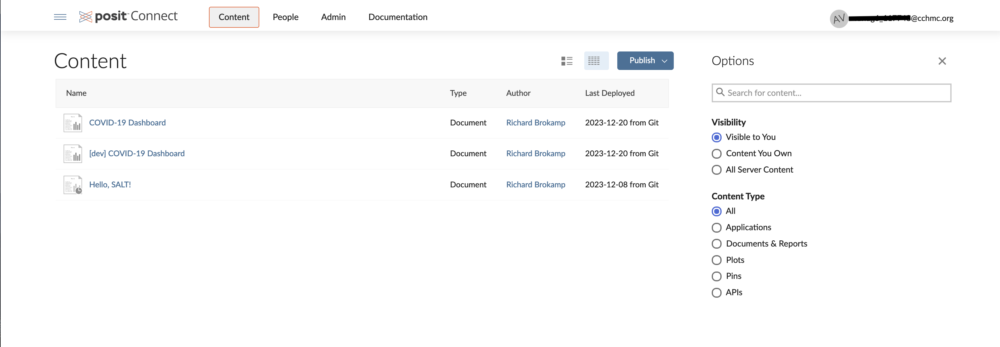

# SALT Publishing Guide

> How-to guide for publishing from CCHMC onto the Situational Awareness Learning Tool (SALT) Posit Connect sever

## Login to Posit Connect

1.  Go to [dev.salt.cchmc.org](https://dev.salt.cchmc.org)
2.  In the top-right corner, click on the "login" button.
    a.  This should send you to a familiar-looking CCHMC login page; enter your credentials as normal
3.  This should bring you to a page that looks something like this: 

## Git-backed Deployment

At SALT, we are utilizing git-backed deployment for publishing. This best-practice technique ensures that your reports and dashboards are always updated and proper version control is enacted. We encourage publishers to use the following workflow:

i. In your project, create a "dev" branch to deploy from
ii. Deploy the "dev" branch to Posit Connect as private
iii. Once you're happy with the deployment, merge your "dev" branch to "main"
iv. Deploy your "main" branch publicly
v. Iteratively merge in future "dev" branches to update your "main" deployment

### In your project
1. In your project repository on GitHub, create a branch off of "main" called "dev"
2. Install the R package called [{rsconnect}](https://rstudio.github.io/rsconnect/)
    a. While in the folder and working directory of the document that you are publishing, run the command `rsconnect::writeManifest()`. This will compile a file called "manifest.json" that Posit Connect will read to host your project on the server. See more information [here](https://rstudio.github.io/rsconnect/reference/writeManifest.html)
    
### On the SALT Posit Connect Server
1. On the "Content" tab of Posit Connect, click the blue "Publish" button and select "Import from Git" from the dropdown menu
2. In the text box, paste the URL of your Git repository (on GitHub, select "Code" -> copy for the correct URL)
3. Select your branch
    a. If this is your first time publishing this project, select your "dev" branch
    b. If you have already privately deployed your dev branch, approved it and merged it in, select your "main" branch
4. Select your root folder. This will be the folder where your `manifest.json` was written and stored
6. Title your content. For clarity, if this is a "dev" branch, please title your content as "[dev]_{your_title}"
6. Select "Deploy Content"

### Publishing Options
- Access
    - There are three available options for visibility: 
        i. Publicly available to anyone with the URL
        ii. Require a CCHMC login
        iii. Limit to specific users/email addresses
    - Adjust these settings by first, while your content is pulled up, selecting the gear icon, then the open padlock icon called "Access".
- Web address
    - While the URL will always begin with "https://dev.salt.cchmc.org", you have the ability to create a custom suffix. Under the "Access" tab in settings, enter the suffix you would like in the Path text box. For example, if you type "my_app", your new URL will be "https://dev.salt.cchmc.org/my_app"
- Scheduling
    - If you are publishing a document like an Rmarkdown or Quarto, you have the option to schedule regular renderings of that document under the "Schedule" tab
- After adjusting any of these settings, be sure to hit the Save button near the top of the panel

### Tags
- For tracking purposes, a SALT admin will create a tag for your project/group. This will primarily be used for usage monitoring, but may be used to determine costs of hosting the object. Simply click the box relevant for your content

### Troubleshooting
- If you click on the symbol that looks like a little notebook, that will pull up the log of your content. In here, you will be able to see both the posit connect log and a log that looks like your typical R console. Here, you will find error messages, making this a great place to start if your app or document is not publishing correctly

    
